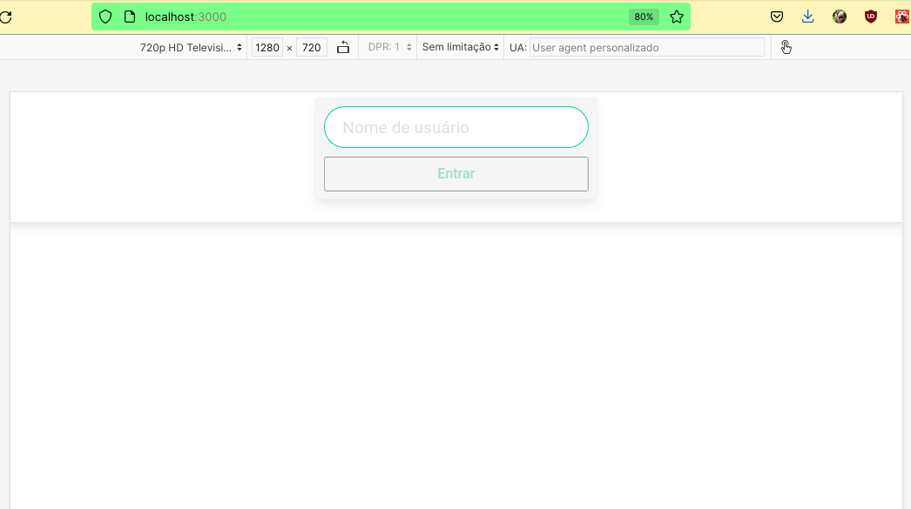

# Copy Tunes
Made in **07/02/2022**. (Edited in 3, july, 2023, only to add Bulma).

## This web app made with React plays music requested from iTunes API.
#### Here I learned how to use React Components like Link, Redirect, Route, Browser Router and Switch, and also used setState function and state and lifecycle.
   

#### To be able to see my project running:

- download the repo;
- type `npm install` and press inter in your terminal;
- type `npm start` and press enter, the application will open in your browser;
- type `npm test` and press enter, the tests will run;

