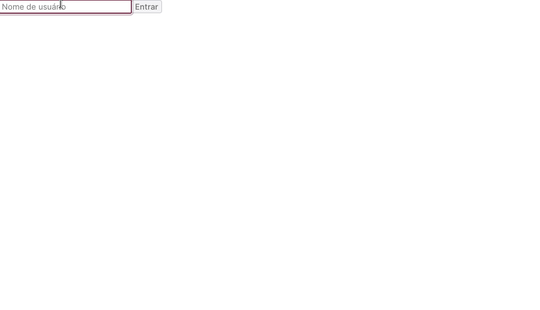
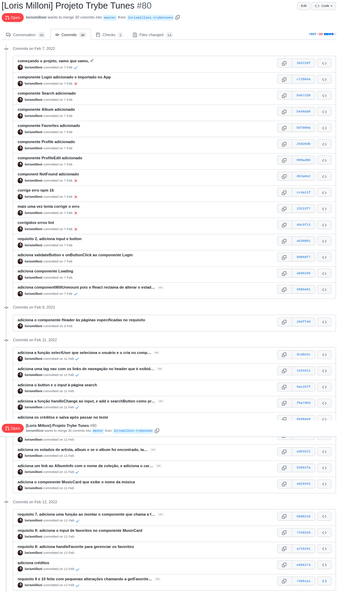
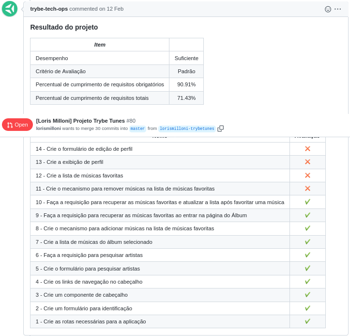

# studies-frontend-song-tunes
Made in **07/02/2022**.

## This web app made with React plays music requested from iTunes API.
#### Here I learned how to use React Components like Link, Redirect, Route, Browser Router and Switch, and also used setState function and state and lifecycle.
  

#### Trybe has a private repository with files that can't be shared. So here is my commit history print:

#### Here is the Trybe Evaluator

